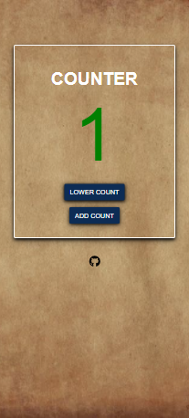

# Javascript counter

This is a solution to Sidehustle Internship frontend web development week 3 task

## Table of contents

- [Overview](#overview)
  - [The challenge](#the-challenge)
  - [Screenshot](#screenshot)
  - [Links](#links)
- [My process](#my-process)
  -[Built with](#built-with)
- [Author](#author)

## Overview

## The challenge

To create a Javascript counter

### Screenshot

### Links
- Solution URL: [https://jsbeginners.com/wp-content/uploads/2019/05/counter-javascript-project.png]

- Live URL: [https://sidehustle-internship-task-3-js-counter.netlify.app/]

## My process

### Built with

- Semantic HTML5 markup
- CSS custom properties
- Javascript
- Flexbox
- Desktop-first workflow

## Author

- Twitter - [@DexterousGodson](https://twitter.com/@DexterousGodson)
- Github - [Dexterouz](https://github.com/Dexterouz)
